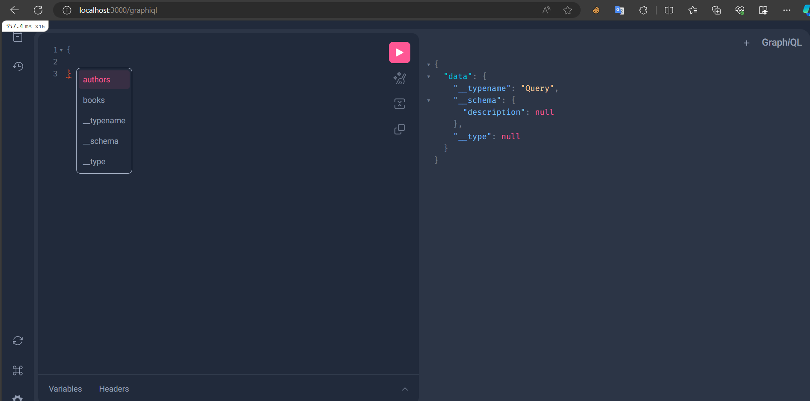

# Sample Rails App with GraphQL
## Database setup
```shell
# create mysql db
podman run --name mysql-db -p 3306:3306 -e MYSQL_ROOT_PASSWORD=my-secret-pw -d mysql:latest

# create a schema
podman exec -it mysql-db mysql -u root -p -e "CREATE DATABASE your_database_name;"
```

## Run rails app
```shell
# install dependencies
bundle install

# Run db migration
bundle exec rails db:migrate

# run
bundle exec rails s -p 3000 -b 0.0.0.0
```
NOTE: You will also need some data, below show how to use `rails c` to generate data 
```ruby
# Create Authors
author = Author.create(name: 'John Doe', age: 45)
author = Author.create(name: 'John Doe 2', age: 45)
author = Author.create(name: 'John Doe 3', age: 45)
author = Author.create(name: 'John Doe 4', age: 45)

book = Book.create(name: 'My first Book', author: Author.first)
book = Book.create(name: 'My Second Book', author: Author.second)
book = Book.create(name: 'My third Book', author: Author.third)
book = Book.create(name: 'My 2nd Book', author: Author.second)
``` 
## Access the Graphiql
<p> Go to http://127.0.0.1:3000/graphiql

### GraphiQL 
